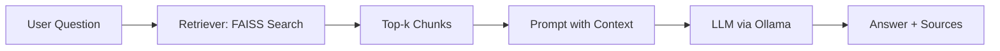

# AI Document Assistant (RAG) 🧠📚

[]()
[]()
[]()
[]()
[]()
[]()

An **AI-powered document assistant** based on **Retrieval Augmented Generation (RAG)**.
Upload documents (TXT/PDF), build a vector index, and ask natural language questions via a **FastAPI** endpoint.
The system retrieves the most relevant chunks from your documents and feeds them to an **LLM** (e.g., Llama via Ollama) for grounded, accurate answers.

---

## ✨ Features

* 🗂️ Supports **TXT/PDF** documents
* 🔎 **FAISS** vector index for fast retrieval
* 🧩 **LangChain** for RAG pipeline orchestration
* 🦙 **Ollama + Llama** for running LLMs locally (pluggable)
* 🌐 **FastAPI** with Swagger UI (`/docs`)
* ⚙️ Flexible configuration via `.env`

---

## 🧭 Architecture



---

## 🚀 Quickstart

### Prerequisites

* Python 3.10+
* (Optional) [Ollama](https://ollama.com/) for running local LLMs:

  ```bash
  ollama serve
  ollama pull llama3.1
  ```

### Setup

```bash
python -m venv .venv
# Windows:
.venv\Scripts\Activate.ps1
# Mac/Linux:
# source .venv/bin/activate

pip install -U pip
pip install -r requirements.txt
cp .env.example .env   # Windows: copy .env.example .env
```

### Add Documents & Build Index

Put `.txt` or `.pdf` files into the `data/` directory (a `sample.txt` is provided). Then run:

```bash
python app/ingest.py
```

### Run API

```bash
uvicorn app.main:app --reload --port 8000
```

* Swagger UI: [http://localhost:8000/docs](http://localhost:8000/docs)

### Example Query (curl)

```bash
curl -X POST http://localhost:8000/ask \
  -H "Content-Type: application/json" \
  -d '{"question":"What is Paris famous for?","k":3}'
```

---

## 🧰 Configuration (`.env`)

| Variable           | Default                                  | Description            |
| ------------------ | ---------------------------------------- | ---------------------- |
| `OLLAMA_BASE_URL`  | `http://localhost:11434`                 | Ollama server URL      |
| `OLLAMA_MODEL`     | `llama3.1`                               | LLM model name         |
| `EMBEDDINGS_MODEL` | `sentence-transformers/all-MiniLM-L6-v2` | Embeddings model       |
| `DATA_DIR`         | `data`                                   | Document directory     |
| `INDEX_DIR`        | `vectorstore`                            | Vector index directory |

---

## 📂 Project Structure

```
rag-doc-assistant/
├─ app/
│  ├─ ingest.py        # Builds FAISS index
│  └─ main.py          # FastAPI with /ask (RAG)
├─ data/               # Place documents here
│  └─ sample.txt
├─ vectorstore/        # Saved index (generated automatically)
├─ .env.example        # Env config template
├─ requirements.txt    # Dependencies
└─ README.md
```

---

## 🧪 Quick Client Test (optional)

`app/ask_client.py`:

```python
import requests

def ask(q, k=4):
    r = requests.post("http://localhost:8000/ask", json={"question": q, "k": k}, timeout=60)
    r.raise_for_status()
    data = r.json()
    print("ANSWER:\n", data["answer"])
    print("\nSOURCES:\n", data["sources"])

if __name__ == "__main__":
    ask("What is Paris famous for?", 3)
```

Run:

```bash
python app/ask_client.py
```

---

## 🐳 Docker (Optional)

### `Dockerfile`

```dockerfile
FROM python:3.12-slim
WORKDIR /app
ENV PYTHONDONTWRITEBYTECODE=1 PYTHONUNBUFFERED=1
RUN apt-get update && apt-get install -y --no-install-recommends build-essential curl && rm -rf /var/lib/apt/lists/*
COPY requirements.txt .
RUN pip install -U pip && pip install --no-cache-dir -r requirements.txt
COPY . .
EXPOSE 8000
CMD ["uvicorn", "app.main:app", "--host", "0.0.0.0", "--port", "8000"]
```

### `docker-compose.yml`

```yaml
version: "3.9"
services:
  ollama:
    image: ollama/ollama:latest
    container_name: ollama
    ports: ["11434:11434"]
    volumes: [ "ollama:/root/.ollama" ]
    restart: unless-stopped

  app:
    build: .
    container_name: rag-app
    depends_on: [ ollama ]
    environment:
      OLLAMA_BASE_URL: http://ollama:11434
      OLLAMA_MODEL: llama3.1
      EMBEDDINGS_MODEL: sentence-transformers/all-MiniLM-L6-v2
    ports: ["8000:8000"]
    volumes:
      - ./data:/app/data
      - ./vectorstore:/app/vectorstore
      - ./.env:/app/.env
    command: sh -c "python app/ingest.py && uvicorn app.main:app --host 0.0.0.0 --port 8000"
volumes:
  ollama:
```

Commands:

```bash
docker compose up -d
docker exec -it ollama ollama pull llama3.1
docker compose restart app
```

---

## 🧩 Tips & Improvements

* Adjust `chunk_size` and `chunk_overlap` in `ingest.py` for better results.
* Replace FAISS with ChromaDB for larger datasets.
* Add authentication & rate-limiting for production.
* Use multilingual embeddings for non-English documents.

---

## 🩹 Troubleshooting

* ❌ *“Failed to load vector index”* → run `python app/ingest.py` again.
* ❌ *Connection refused to Ollama* → run `ollama serve` and `ollama pull llama3.1`.
* ⚠️ Pylance warnings in VS Code → `Python: Select Interpreter` → choose `.venv`, then `Pylance: Restart`.

---

## 📝 License

This project is licensed under the **MIT License**. Use, modify, and enjoy 🙏
